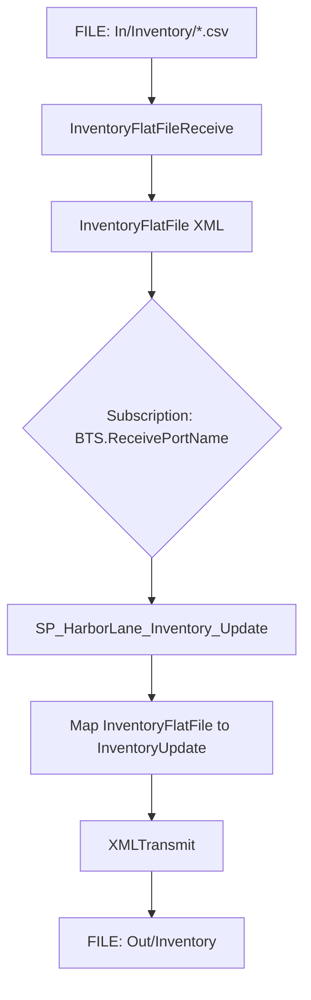

# Inventory Update — Architecture

Source diagram: [architecture.mmd](architecture.mmd)

```mermaid
flowchart TB
  A["FILE: In/Inventory/*.csv"] --> B["InventoryFlatFileReceive"]
  B --> C["InventoryFlatFile XML"]
  C --> D{"Subscription: BTS.ReceivePortName"}
  D --> E["SP_HarborLane_Inventory_Update"]
  E --> F["Map InventoryFlatFile to InventoryUpdate"]
  F --> G["XMLTransmit"]
  G --> H["FILE: Out/Inventory"]
```
