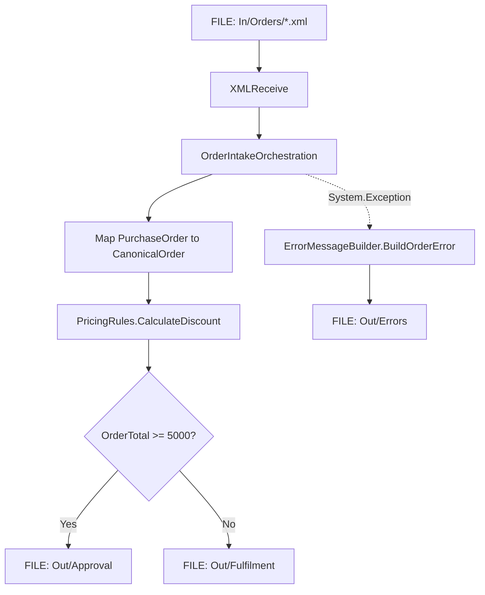

# Order Intake — Architecture

Source diagram: [architecture.mmd](architecture.mmd)

```mermaid
flowchart TB
  A["FILE: In/Orders/*.xml"] --> B["XMLReceive"]
  B --> C["OrderIntakeOrchestration"]
  C --> D["Map PurchaseOrder to CanonicalOrder"]
  D --> E["PricingRules.CalculateDiscount"]
  E --> F{"OrderTotal >= 5000?"}
  F -->|Yes| G["FILE: Out/Approval"]
  F -->|No| H["FILE: Out/Fulfilment"]
  C -. "System.Exception" .-> I["ErrorMessageBuilder.BuildOrderError"]
  I --> J["FILE: Out/Errors"]
```
