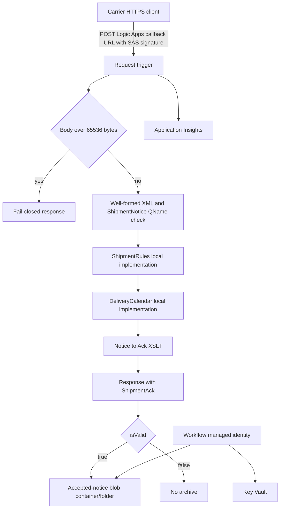

# shipment-notification — Architecture

Source diagram: [architecture.mmd](architecture.mmd)

```mermaid
flowchart TB
  CALLER[Carrier HTTPS client] -->|POST Logic Apps callback URL with SAS signature| REQ[Request trigger]
  REQ --> SIZE{Body over 65536 bytes}
  SIZE -->|yes| REJECT[Fail-closed response]
  SIZE -->|no| TYPE[Well-formed XML and ShipmentNotice QName check]
  TYPE --> RULES[ShipmentRules local implementation]
  RULES --> ETA[DeliveryCalendar local implementation]
  ETA --> XSLT[Notice to Ack XSLT]
  XSLT --> RESP[Response with ShipmentAck]
  RESP --> ACCEPTED{isValid}
  ACCEPTED -->|true| ARCHIVE[Accepted-notice blob container/folder]
  ACCEPTED -->|false| DONE[No archive]
  MI[Workflow managed identity] --> ARCHIVE
  MI --> KV[Key Vault]
  REQ --> AI[Application Insights]
```
